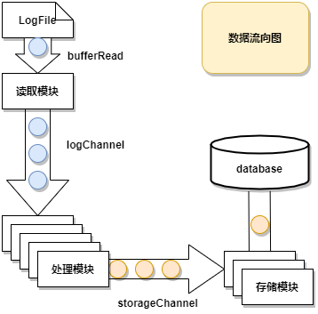

# go-log-listener
> 本项目始于2019年春节期间，因新型冠状病毒爆发，在家里闲着无聊，遂进行Golang的并发编程学习，在看完慕课网的《 基于Golang协程实现流量统计系统》后有感而发，并结合《Go语言并发之道》进行Go语言的深入学习了解，并最终抽象成为一个简单易用的日志监听库。本人编程能力有限，如有设计考虑不周，还请大佬进行指点。

## 一、功能介绍

为了更加便捷的实现日志文件监听存储功能。

- [x] 自定义并发数量
- [x] 自定义日志处理
- [ ] 自定义文件监听起始行数
- [x] 终止监听
- [ ] 重新监听
- [x] Nginx监听实例：模拟Nginx日志生成，并结合Redis实现PV，UV统计存储

## 二、快速开始

### 安装

```bash
go get github.com/taoey/go-log-listener
```

### 使用

如下实例代码模拟了日志文件处理流程（可结合[example/nginx_log_listener_test.go](example/nginx_log_listener_test.go)理解）

`access.log`为同级目录下的日志文件，其内容为：

```
{"addr":"192.168.35.87","time":"03/Feb/2020:16:57:03 +0800","req":"GET /048.png HTTP/1.1"}
{"addr":"192.168.3.40","time":"08/Feb/2020:16:57:03 +0800","req":"GET /018.png HTTP/1.1"}
{"addr":"192.168.10.76","time":"06/Feb/2020:16:57:03 +0800","req":"GET /089.png HTTP/1.1"}
```

代码示例：

```go
logListener := listener.NewDefaultLogListener("access.log")
logHandler:= func(str string) interface{} {
	fmt.Print("日志解析：",str)
	return str
}
logStorageHandler := func(log interface{}) {
	fmt.Print("日志存储：",log)
}
logListener.SetHandler(logHandler,logStorageHandler)
logListener.Run()

time.Sleep(time.Minute * 3)
```

控制台打印：

```
日志解析：{"addr":"192.168.3.40","time":"08/Feb/2020:16:57:03 +0800","req":"GET /018.png HTTP/1.1"}
日志解析：{"addr":"192.168.10.76","time":"06/Feb/2020:16:57:03 +0800","req":"GET /089.png HTTP/1.1"}
日志存储：{"addr":"192.168.3.40","time":"08/Feb/2020:16:57:03 +0800","req":"GET /018.png HTTP/1.1"}
日志存储：{"addr":"192.168.10.76","time":"06/Feb/2020:16:57:03 +0800","req":"GET /089.png HTTP/1.1"}
日志解析：{"addr":"192.168.35.87","time":"03/Feb/2020:16:57:03 +0800","req":"GET /048.png HTTP/1.1"}
日志存储：{"addr":"192.168.35.87","time":"03/Feb/2020:16:57:03 +0800","req":"GET /048.png HTTP/1.1"}

```


## 三、实现原理



---

有问题可以提Issue或者关注我的公众号联系我：

